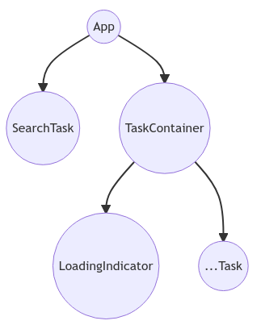

# Exercise: Data Fetching

## 🎇 Goals

- Fetch a data with React Hook: useEffect.

- Request a data over **GET** method with [Axios](https://github.com/axios/axios).
- Provide a **loading indicator** while waiting the data.

## 🪡 Implementation Details

- The app was bootstrapped with `create-snowpack-app`, per se.
- [TailwindCSS](https://tailwindcss.com/) for styling.




## ⌛ What i've learned

1. We can't use `async` function for the `useEffect` hook parameter. But instead, we could create an `async` inside of it.

2. To specifying the _LOADING_ state, we should call it directly or inside a fetch-related code blocks. For example:

   ```javascript
   const fetchData = async () => {
     setIsLoading(true); // set loading state
     // ... fetching the data

     setIsLoading(false); // unset loading state
   }
   ```

3. We need to install `@snowpack/plugin-postcss` and `cssnano` for the Snowpack to works with the PostCSS module. It has to be a TailwindCSS's tooling requirement.

   ```bash
   $ yarn add @snowpack/plugin-postcss cssnano
   ```

   then edit the `snowpack.config.js` and `postcss.config.js` files respectively.

4. I couldn't make the TailwindCSS's JIT feature to work with Snowpack, yet.
